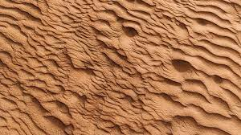
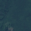

# CNN for Satellite Image Classification
Satellite image classification is the most significant technique used in remote sensing for the computerized study and pattern recognition of satellite information, which is based on diversity structures of the image that involve rigorous validation of the training samples depending on the used classification algorithm.

     

## What is it?

This is a pytorch implementation of a deep learning model for classification of satellite images. The proposed architecture is based on tranfer learning and uses ResNet50, VGG16, and AlexNet classification models as backbone pre-trained models.

## Requirements
For running the sample code:
- [Python](https://www.python.org/)
- [Pytorch](https://pytorch.org/)
- [Matplotlib](https://matplotlib.org/)

## Dataset
Satellite image Classification Dataset-RSI-CB256. This dataset has 4 different classes mixed from Sensors and google map snapshot.

The input image size for CNN is 224*224, it means we need to resize all images to this size. See example image as below:

<table>
    <tr>
        <td> <figure> <figcaption>Cloudy</figcaption>  </figure> </td>
        <td> <figure> <figcaption>Desert</figcaption>  </figure> </td>
        <td> <figure> <figcaption>Forest</figcaption>  </figure> </td>
        <td> <figure> <figcaption>Water</figcaption>  </figure> </td>
    </tr> 
</table>

| Data      | Number of Images | 
| :---        |    :----:   |   
| Train Set      | 4504       | 
| Test Set   | 1127        | 

## CNN models

The CNN models applied in this project includes 
ResNet50, ALexNet, and VGG. We compare the test accuracy of each CNN model in our dataset and the conclusion is ResNet50 has the best performance with 92 % test accuracy.

## Experiments

### Results

| Model      | Test Accuracy | Test Loss |
| :---        |    :----:   |   :----:   |
| ResNet18   | 99%        | 0.0247 |
| ResNet34   | 99%        | 0.0571 |
| ResNet50   | 98%       | 0.1050 | 